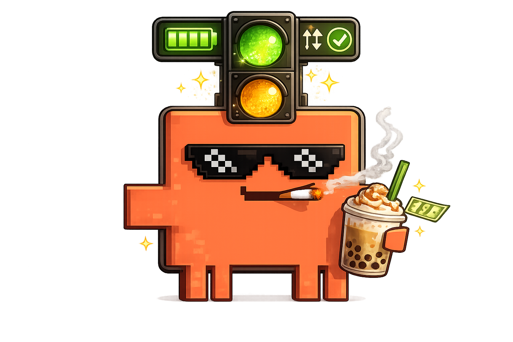
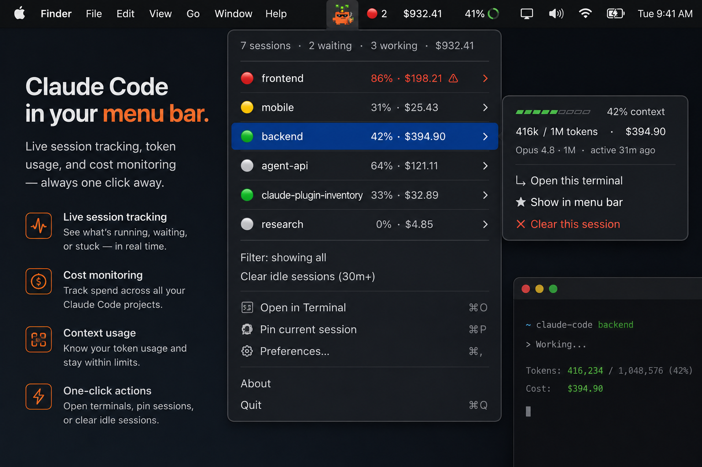

<div align="center">



<h1>claude-statusbar</h1>

<p><b>A macOS menu-bar dashboard light for <a href="https://claude.com/claude-code">Claude Code</a>.</b><br/>
Know when a session needs you, what's working, how full each context window is,<br/>and how much you've spent — without ever watching the terminal.</p>

<p>
<a href="https://github.com/rikenpatel20/claude-statusbar/actions/workflows/ci.yml"></a>


<a href="./LICENSE"></a>

</p>

<br/>



</div>

---

```
menu bar:  🔴 2        ← two sessions are waiting on you
           │
           ├─ 5 sessions · 2 waiting · 1 working · $48.20
           ├─ 🔴 api-server     83% · $12.05   ⚠
           ├─ 🔴 web-app        41% · $6.31    ⚠
           ├─ 🟡 worker         15% · $1.46
           ├─ ⚪ data-pipeline  66% · $9.36
           └─ ⚪ docs-site       8% · $0.85
              hover a row → context bar · model · "open terminal" · pin · clear
```

> When Claude Code needs permission, it sits **silently** in the terminal. If that
> window isn't in front, you don't know it's waiting — it can be stuck for an hour.
> `claude-statusbar` turns that into a glanceable light in your menu bar, and pings
> you the instant any session needs you.

## Contents

- [Features](#features)
- [Quick start](#quick-start)
- [How it works](#how-it-works)
- [Components](#components)
- [The state file (the contract)](#the-state-file-the-contract)
- [Using the menu](#using-the-menu)
- [Keep your own status line](#keep-your-own-status-line)
- [Verify](#verify)
- [Troubleshooting](#troubleshooting)
- [Contributing](#contributing)
- [Roadmap](#roadmap)
- [License](#license)

## Features

| | |
|---|---|
| 🟢🟡🔴 **Always-on icon** | the mascot in your menu bar with a colored badge — red count when sessions need you, amber when working, or your pinned project's live context % |
| 🔔 **Instant alerts** | native notification + sound the moment a session hits a permission prompt |
| 📊 **Live tokens + cost** | per session, with a context-fill bar (auto-detects 200K vs 1M models) |
| 🖱️ **Click to focus** | jump straight to that session's terminal window/tab (matched by tty) |
| 📌 **Pin & filter** | feature one project's live %/cost in the bar; hide the rest |
| 🧹 **Honest status** | a quiet "working" session is auto-marked idle, finished runs auto-drop after 30m, and stale entries clear in one click |
| 🪶 **Zero deps** | pure `python3` + a shell installer; wraps (never replaces) your status line |

## Quick start

SwiftBar is **free and open source** — no paid tier or developer account required.

### Homebrew (recommended)

```bash
brew install --cask swiftbar                      # the menu-bar host
brew install rikenpatel20/tap/claude-statusbar    # the tracker
claude-statusbar --write-settings                 # installs scripts + plugin, patches settings.json (backs it up)
```

### From source

```bash
brew install --cask swiftbar      # the menu-bar host
git clone https://github.com/rikenpatel20/claude-statusbar
cd claude-statusbar
./install.sh --write-settings     # installs scripts + plugin, patches settings.json (backs it up)
```

Restart Claude Code. That's it — the icon appears as soon as a session is active.

<sub>Prefer to wire it yourself? Run `claude-statusbar` (or `./install.sh`) with no
flag and merge the printed `settings.snippet.json` into `~/.claude/settings.json` by hand.</sub>

## How it works

Claude Code already emits the signals; this project just records and displays them.

```
Claude Code ──hooks + status line──►  ~/.claude/status/<session>.json  ──►  menu bar
```

1. **Hooks** (`cc-status.py`) fire on Claude Code events and write a small JSON
   state file per session:

   | Event | Status set |
   |---|---|
   | `Notification` (permission/tool prompt) | `needs-attention` (also fires the notification) |
   | `Notification` (idle "waiting for your input") | `done` — *not* a red alarm; the turn just finished |
   | `UserPromptSubmit` / `PostToolUse` | `working` |
   | `Stop` | `done` |
   | `SessionEnd` | removes the state file |

   Claude Code's `Notification` event covers both real permission prompts and
   plain end-of-turn idle — only the former is treated as an action item, so the
   menu bar never shows a false "waiting on you".

2. **Status line** (`cc-statusline.py`) runs on every refresh and records live
   token (context usage) + cost — plus the session's terminal tty — into the same
   file. It can `--chain` your existing status line so your in-terminal display is
   unchanged.
3. **Front-end** (`claude.2s.py`, a [SwiftBar](https://github.com/swiftbar/SwiftBar)
   plugin) reads the state files and renders the menu bar every 2 seconds.
4. **Click actions** (`cc-focus.py`, `cc-config.py`) focus a terminal and handle
   pin / filter / clear.

## Components

| File | Role |
|---|---|
| `src/cc-status.py` | Hook: records status, captures tty, fires the notification |
| `src/cc-statusline.py` | Status line: records tokens + cost; `--chain` an existing one |
| `src/cc-focus.py` | Brings a session's terminal window/tab to the front (by tty) |
| `src/cc-config.py` | Menu actions: pin / filter / clear / clear-stale |
| `src/claude.2s.py` | SwiftBar plugin — the menu-bar UI |
| `scripts/merge_settings.py` | Safe, idempotent, backed-up `settings.json` merge |

## The state file (the contract)

The writers and the front-end are decoupled by a documented schema, so you can
build your own indicator (tmux, waybar, Raycast, web) against the same files:

```jsonc
// ~/.claude/status/<session_id>.json
{
  "session_id": "abc123",
  "project":    "web-app",            // basename of cwd
  "cwd":        "/Users/me/code/web-app",
  "model":      "Opus 4.8",
  "status":     "needs-attention",    // needs-attention | working | done | idle
  "message":    "Permission needed: Bash",
  "tokens":     12431,                // current context-window usage
  "cost_usd":   0.08,
  "term":       "Apple_Terminal",     // TERM_PROGRAM, for focusing
  "tty":        "/dev/ttys004",       // for focusing the exact tab
  "updated_at": 1719230000            // unix seconds; readers hide stale files
}
```

Menu-bar preferences live in `~/.claude/status/config.json`:

```jsonc
{ "primary": "web-app",  // pinned project shown in the bar
  "filter":  false }     // show only the pinned project
```

## Using the menu

- **Click a session row** → opens that session's terminal window/tab.
- **Hover a row** → context bar, model, "active Xm ago", and actions.
- **★ Show in menu bar** → feature that project's live %/cost in the bar.
- **Filter: pinned only** → hide everything except the pinned project.
- Finished sessions **auto-drop after 30 minutes**; **Clear idle sessions (30m+)**
  or the per-row **✕** removes their state files immediately.

### Options

- `CC_NOTIFY_ON_DONE=1` — also notify (quietly) when a session finishes.
- `CC_NOTIFY_SOUND=Glass` — change the alert sound (any macOS system sound name).

## Keep your own status line

Already have a custom status line? Chain it so it's recorded *and* displayed
unchanged:

```json
{ "statusLine": {
    "type": "command",
    "command": "~/.claude/status/cc-statusline.py --chain ~/.claude/statusline.sh"
} }
```

## Verify

```bash
bash tests/smoke_test.sh
```

Runs the whole hook → status-line → plugin pipeline against a throwaway `HOME`,
so it never touches your real `~/.claude`. Requires only `python3`. This is the
same suite CI runs on macOS and Linux.

## Troubleshooting

- **No icon in the menu bar:** the bar may be full (icons hide when crowded) — try
  removing other items. Confirm SwiftBar is running and pointed at the plugin folder.
- **First notification didn't appear:** macOS may hold the first banner until you
  allow notifications for the script runner in **System Settings → Notifications**.
- **Clicking a row only activates the app (doesn't switch tabs):** that session
  hadn't recorded its tty yet — captured on the next status-line refresh.
- **Clicking opens VS Code instead of a terminal window:** that session runs inside
  VS Code's *integrated* terminal (`TERM_PROGRAM=vscode`), so focusing VS Code is
  correct — the integrated terminal can't be targeted more precisely.

## Contributing

PRs welcome! The core is intentionally tiny and dependency-free. A great first
contribution is a **new front-end** against the [state-file schema](#the-state-file-the-contract)
(tmux, waybar, Raycast, a web dashboard…). See [CONTRIBUTING.md](./CONTRIBUTING.md)
and please run `bash tests/smoke_test.sh` before opening a PR.

## Roadmap

- [ ] Native SwiftUI `MenuBarExtra` app (single download, launch-at-login).
- [ ] Linux front-end (waybar / polybar) reading the same schema.
- [ ] Per-project token budgets with warning thresholds.

## License

[MIT](./LICENSE) © 2026 Riken Patel. Logo & mascot © 2026 Riken Patel.

<div align="center"><sub>Built for people who run too many Claude Code sessions at once.</sub></div>
